# Customer Frontend API Implementation Plan

## Overview
This plan outlines the implementation of the customer frontend APIs based on the provided API documentation. The goal is to create a centralized, reusable, and clean API integration with proper error handling using sonner for notifications.

## Architecture

```mermaid
graph TD
    A[lib/api-client.ts] --> B[hooks/use-api.ts]
    B --> C[hooks/use-auth.ts]
    B --> D[hooks/use-books.ts]
    B --> E[hooks/use-categories.ts]
    B --> F[hooks/use-publications.ts]
    B --> G[hooks/use-subjects.ts]
    B --> H[hooks/use-banners.ts]
    B --> I[hooks/use-teachers.ts]
    B --> J[hooks/use-reviews.ts]
    B --> K[hooks/use-book-parts.ts]
    B --> L[hooks/use-cart.ts]
    B --> M[hooks/use-wishlist.ts]
    B --> N[hooks/use-addresses.ts]
    B --> O[hooks/use-orders.ts]
    B --> P[hooks/use-settings.ts]
    
    Q[contexts/AuthContext.tsx] --> C
    R[contexts/CartContext.tsx] --> L
    S[contexts/WishlistContext.tsx] --> M
    T[contexts/AddressContext.tsx] --> N
    U[contexts/OrderContext.tsx] --> O
    
    V[app/providers.tsx] --> Q
    V --> R
    V --> S
    V --> T
    V --> U
    
    W[components/*] --> L
    W --> M
    W --> N
    W --> O
```



## File Structure

```
lib/
  api-client.ts          # Centralized API client with base URL and interceptors
  types.ts               # All TypeScript type definitions

hooks/
  use-api.ts             # Base hook with error handling and sonner integration
  use-auth.ts            # Authentication hook (login, register, token)
  use-books.ts           # Book APIs
  use-categories.ts      # Category APIs
  use-publications.ts    # Publication APIs
  use-subjects.ts        # Subject APIs
  use-banners.ts         # Banner APIs
  use-teachers.ts        # Teacher APIs
  use-reviews.ts         # Review APIs
  use-book-parts.ts      # Book Part APIs
  use-cart.ts            # Cart APIs
  use-wishlist.ts        # Wishlist APIs
  use-addresses.ts       # Address APIs
  use-orders.ts          # Order APIs
  use-settings.ts        # Settings APIs

contexts/
  AuthContext.tsx        # Updated with real API integration
  CartContext.tsx        # Updated with real API integration
  WishlistContext.tsx      # New - Wishlist state management
  AddressContext.tsx       # New - Address state management
  OrderContext.tsx         # New - Order state management

app/
  providers.tsx            # Updated with all providers
  login/page.tsx           # Updated to use real API
  checkout/page.tsx        # Updated to use real API
  profile/page.tsx         # Updated to use real API
  book/[id]/page.tsx       # Updated to use real API
```

## Implementation Steps

### Phase 1: Core Infrastructure

- [ ] **Create `lib/types.ts`** - Define all TypeScript interfaces matching API response structures
- [ ] **Create `lib/api-client.ts`** - Centralized fetch wrapper with:
  - Base URL configuration
  - JWT token injection from localStorage
  - Error response handling
  - Response transformation for consistent format
- [ ] **Create `hooks/use-api.ts`** - Base hook with:
  - React Query integration
  - Sonner toast for error messages
  - Loading states
  - Cache management

### Phase 2: API Hooks

- [ ] **Create `hooks/use-auth.ts`** - Authentication operations:
  - `login(email, password)` - POST /api/auth/login
  - `register(email, password)` - POST /api/auth/signup
  - `logout()` - Clear token and user state
  - `getToken()` - Retrieve token from localStorage
  - `setToken(token)` - Store token in localStorage

- [ ] **Create `hooks/use-books.ts`** - Book operations:
  - `getBooks()` - GET /api/books
  - `getBook(id)` - GET /api/books/{id}

- [ ] **Create `hooks/use-categories.ts`** - Category operations:
  - `getCategories()` - GET /api/categories
  - `getCategory(id)` - GET /api/categories/{id}

- [ ] **Create `hooks/use-publications.ts`** - Publication operations:
  - `getPublications()` - GET /api/publications
  - `getPublication(id)` - GET /api/publications/{id}

- [ ] **Create `hooks/use-subjects.ts`** - Subject operations:
  - `getSubjects()` - GET /api/subjects
  - `getSubject(id)` - GET /api/subjects/{id}

- [ ] **Create `hooks/use-banners.ts`** - Banner operations:
  - `getBanners()` - GET /api/banners
  - `getBanner(id)` - GET /api/banners/{id}

- [ ] **Create `hooks/use-teachers.ts`** - Teacher operations:
  - `getTeachers()` - GET /api/teachers
  - `getTeacher(id)` - GET /api/teachers/{id}

- [ ] **Create `hooks/use-reviews.ts`** - Review operations:
  - `getReviews(bookId)` - GET /api/reviews?bookId={bookId}
  - `getReview(id)` - GET /api/reviews/{id}

- [ ] **Create `hooks/use-book-parts.ts`** - Book Part operations:
  - `getBookParts(bookId)` - GET /api/book-parts?bookId={bookId}
  - `getBookPart(id)` - GET /api/book-parts/{id}

- [ ] **Create `hooks/use-cart.ts`** - Cart operations:
  - `getCart()` - GET /api/cart
  - `addToCart(bookId, quantity)` - POST /api/cart
  - `updateCartItem(cartItemId, quantity)` - PATCH /api/cart/items/{id}
  - `removeFromCart(cartItemId)` - DELETE /api/cart/items/{id}
  - `clearCart()` - DELETE /api/cart

- [ ] **Create `hooks/use-wishlist.ts`** - Wishlist operations:
  - `getWishlist()` - GET /api/wishlist
  - `addToWishlist(bookId)` - POST /api/wishlist
  - `removeFromWishlist(bookId)` - DELETE /api/wishlist/{bookId}

- [ ] **Create `hooks/use-addresses.ts`** - Address operations:
  - `getAddresses()` - GET /api/addresses
  - `createAddress(data)` - POST /api/addresses
  - `getAddress(id)` - GET /api/addresses/{id}
  - `updateAddress(id, data)` - PATCH /api/addresses/{id}
  - `deleteAddress(id)` - DELETE /api/addresses/{id}

- [ ] **Create `hooks/use-orders.ts`** - Order operations:
  - `createOrder(data)` - POST /api/orders
  - `getOrders()` - GET /api/orders
  - `getOrder(id)` - GET /api/orders/{id}

- [ ] **Create `hooks/use-settings.ts`** - Settings operations:
  - `getSettings()` - GET /api/settings
  - `getSetting(key)` - GET /api/settings/{key}

### Phase 3: Context Updates

- [ ] **Update `contexts/AuthContext.tsx`** - Replace mock with real API:
  - Use `useAuth` hook internally
  - Store JWT token in localStorage
  - Handle token expiration
  - Update user state on login/register

- [ ] **Update `contexts/CartContext.tsx`** - Replace mock with real API:
  - Use `useCart` hook internally
  - Sync with server on mount
  - Optimistic updates for better UX

- [ ] **Create `contexts/WishlistContext.tsx`** - Wishlist state management:
  - Use `useWishlist` hook internally
  - Provide wishlist state to components

- [ ] **Create `contexts/AddressContext.tsx`** - Address state management:
  - Use `useAddresses` hook internally
  - Provide addresses state to components

- [ ] **Create `contexts/OrderContext.tsx`** - Order state management:
  - Use `useOrders` hook internally
  - Provide orders state to components

### Phase 4: Component Updates

- [ ] **Update `app/providers.tsx`** - Add all new providers

- [ ] **Update `app/login/page.tsx`** - Use real API for authentication

- [ ] **Update `app/checkout/page.tsx`** - Use real API for cart and addresses

- [ ] **Update `app/profile/page.tsx`** - Use real API for addresses and orders

- [ ] **Update `app/book/[id]/page.tsx`** - Use real API for book details

- [ ] **Update `components/Navbar.tsx`** - Use real API for categories

- [ ] **Update `components/CartDrawer.tsx`** - Use real API for cart operations

- [ ] **Update `components/BookCard.tsx`** - Use real API data structure

- [ ] **Update `components/HeroBanner.tsx`** - Use real API for banners

- [ ] **Update `components/NewReleases.tsx`** - Use real API for books

- [ ] **Update `components/Featured.tsx`** - Use real API for books

- [ ] **Update `components/DealOfTheDay.tsx`** - Use real API for books

- [ ] **Update `components/PopularBooks.tsx`** - Use real API for books

### Phase 5: Cleanup

- [ ] **Remove `data/books.ts`** - No longer needed, using real API

## Key Design Decisions

### 1. API Client Pattern
```typescript
// lib/api-client.ts
const apiClient = {
  get: <T>(url: string) => Promise<ApiResponse<T>>
  post: <T>(url: string, data: unknown) => Promise<ApiResponse<T>>
  patch: <T>(url: string, data: unknown) => Promise<ApiResponse<T>>
  delete: <T>(url: string) => Promise<ApiResponse<T>>
}
```

### 2. Hook Pattern with React Query
```typescript
// hooks/use-books.ts
export const useBooks = () => {
  return useQuery({
    queryKey: ['books'],
    queryFn: () => apiClient.get<Book[]>('/books')
  })
}
```

### 3. Error Handling with Sonner
```typescript
// hooks/use-api.ts
const handleError = (error: ApiError) => {
  toast.error(error.message)
}
```

### 4. Token Management
- Store `accessToken` in localStorage
- Inject in Authorization header automatically
- Clear on 401 responses

## API Response Types

All API responses follow this format:
```typescript
interface ApiResponse<T> {
  message: string;
  status: 'success' | 'error';
  data: T;
}
```

## Notes

- All hooks use React Query for caching and state management
- Sonner is used for all error notifications
- No mock data - all data comes from real API endpoints
- JWT token is stored in localStorage and injected automatically
- Soft-deleted records are handled by the backend (excluded from public queries)